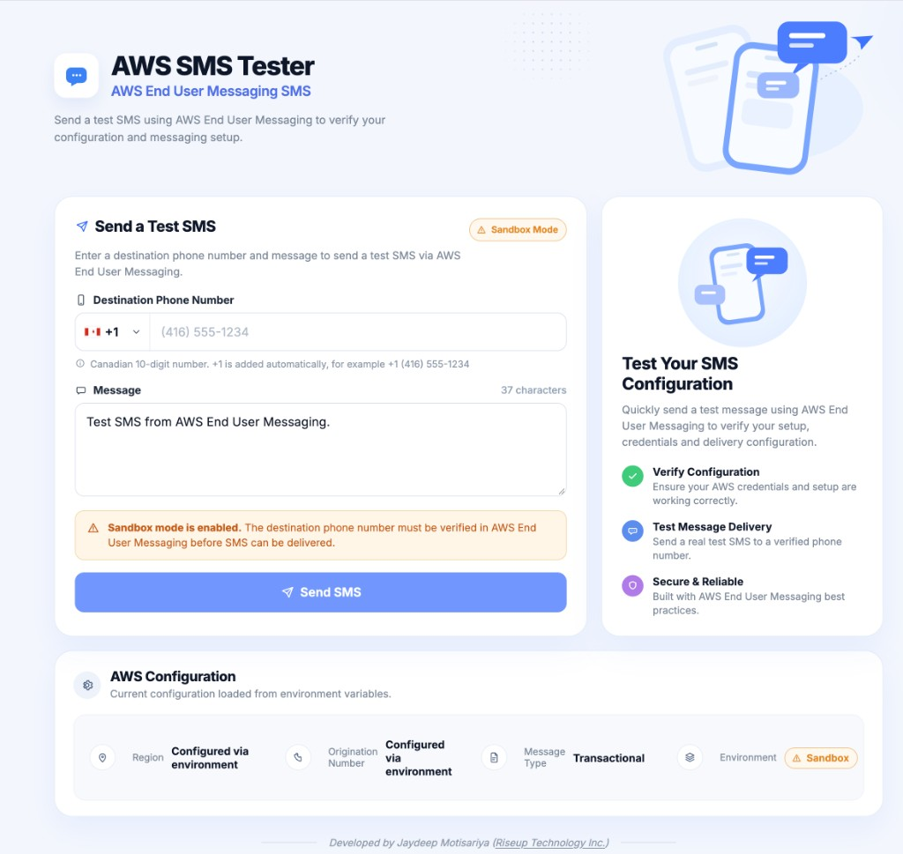

# AWS SMS Tester

A simple **Next.js** application for testing SMS delivery using **AWS End User Messaging SMS** from a local development environment.

This project allows a developer to:

- Enter a destination phone number
- Enter a custom SMS message
- Send SMS through AWS End User Messaging SMS
- Test locally using AWS CLI credentials
- Test while the AWS account is still in SMS Sandbox mode

The project intentionally keeps AWS credentials out of the source code and uses the AWS SDK default credential provider chain.



Contributions are welcome. Feel free to improve the app, fix a bug, or make the setup clearer. Everyone is invited to take part.

---

## Architecture

```text
Browser
   ↓
Next.js UI
   ↓
POST /api/send-sms
   ↓
Next.js Server API Route
   ↓
AWS SDK
   ↓
AWS End User Messaging SMS
   ↓
Destination Phone
```

AWS SDK calls must run only on the server side. AWS credentials must never be exposed to the browser.

---

## 1. Prerequisites

Before running the project, make sure you have:

- Node.js 20.9 or later
- npm, which is included with Node.js
- An AWS account
- Access to AWS End User Messaging SMS
- A dedicated IAM user for local SMS testing
- An active AWS SMS origination phone number
- A verified destination phone number while using Sandbox mode

Homebrew is not required. It is only one way to install Node.js and the AWS CLI on macOS. Windows setup is covered below.

### Install Node.js

Check what is already installed:

```bash
node --version
npm --version
```

This project uses Next.js 16, which requires Node.js 20.9 or later.

#### macOS

Install with Homebrew:

```bash
brew update
brew install node
```

Or download the LTS installer from [https://nodejs.org](https://nodejs.org).

#### Windows

Download the LTS installer from [https://nodejs.org](https://nodejs.org) and run it. The installer includes npm.

Or, in PowerShell:

```powershell
winget install OpenJS.NodeJS.LTS
```

Close the terminal and open a new PowerShell or Command Prompt window, then run `node --version` and `npm --version` again. Windows does not update `PATH` in terminals that were already open.

---

## 2. Open AWS End User Messaging SMS

In the AWS Console, go to:

```text
AWS End User Messaging
→ SMS
```

New AWS End User Messaging SMS accounts normally start in **Sandbox mode**.

While in Sandbox mode:

- SMS can only be sent to verified destination phone numbers
- Production access is required before sending to arbitrary customer numbers
- Spending limits may also be restricted

---

## 3. Create an Origination Phone Number

Go to:

```text
AWS End User Messaging
→ SMS
→ Phone numbers
→ Request originator
```

Select the destination country you plan to support.

For a basic Canadian transactional SMS setup, select:

```text
Country:
Canada

Number capability:
SMS / MMS

Two-way messaging:
No
```

For the originator type, select:

```text
Long code
```

A long code is suitable for local testing, OTP messages, secure form links, and basic transactional SMS.

After requesting the number, wait until its status becomes:

```text
Active
```

Do not use the number while the status is still:

```text
Pending
```

Once active, copy the number for use in your local environment file.

Use E.164 format:

```text
+1XXXXXXXXXX
```

Do not hardcode the origination phone number in the source code.

---

## 4. Verify a Destination Phone Number

While AWS End User Messaging SMS is in Sandbox mode, SMS can only be sent to verified destination numbers.

Go to:

```text
AWS End User Messaging
→ SMS
→ Shortcuts
→ SMS Simulator
```

Under **Destination number**, select:

```text
Verified number
```

Then click:

```text
Verify new number
```

Enter the destination phone number using E.164 format.

Example:

```text
+14165551234
```

AWS will send a verification code to that phone.

Enter the code in AWS to complete verification.

After verification, the number can be used for local SMS testing.

---

## 5. Send a Test SMS From the AWS Console

Before testing the codebase, confirm that the AWS SMS configuration itself works.

Go to:

```text
AWS End User Messaging
→ SMS
→ Shortcuts
→ SMS Simulator
```

Select:

```text
Originator:
Phone number
```

Choose your active origination number.

For destination, select:

```text
Verified number
```

Choose the verified test phone number.

For basic testing:

```text
Configuration set:
Leave blank

Protect configuration:
Leave blank
```

Enter a test message:

```text
Test SMS from AWS End User Messaging.
```

Click:

```text
Send test message
```

Confirm that the SMS is received before continuing.

---

## 6. Request Production Access

Production access is not required for local development as long as the destination phone number is verified.

When you are ready to move beyond Sandbox mode, go to:

```text
AWS End User Messaging
→ SMS
→ Overview
→ Request production access
```

AWS may redirect you to AWS Support.

Typical values include:

```text
Resource Type:
General Limits

Quota:
SMS Production Access

New quota value:
1
```

Select the AWS region where your SMS resources are configured.

Provide a clear use case, for example:

```text
Our web application uses AWS End User Messaging SMS for transactional
communication.

SMS messages are used for:

1. One-time password verification.
2. Secure form links associated with application workflows.

Users provide their phone number directly and initiate or consent to
receiving these messages.

We do not send unsolicited promotional or marketing messages.
```

You can continue local testing while the production request is being reviewed.

---

## 7. Create a Dedicated IAM User for Local Development

Create a dedicated IAM user instead of using root credentials or broad administrator credentials.

Go to:

```text
IAM
→ Users
→ Create user
```

Recommended user name:

```text
local-sms-dev
```

Console access is not required.

Create or attach a least-privilege policy that only allows sending SMS.

Use this policy:

```json
{
  "Version": "2012-10-17",
  "Statement": [
    {
      "Effect": "Allow",
      "Action": "sms-voice:SendTextMessage",
      "Resource": "*"
    }
  ]
}
```

Recommended policy name:

```text
SendEndUserMessagingSMS
```

Do not attach broad policies such as:

```text
AdministratorAccess
```

The local testing user only needs permission to send SMS.

---

## 8. Create an Access Key for Local Development

Open:

```text
IAM
→ Users
→ local-sms-dev
→ Security credentials
→ Access keys
→ Create access key
```

Choose:

```text
Local code
```

AWS will generate:

```text
Access Key ID
Secret Access Key
```

Save them securely when they are shown.

Do not:

- Commit them to Git
- Add them to the project source code
- Put them in `.env.local`
- Share them in screenshots or documentation

---

## 9. Install the AWS CLI

Install AWS CLI version 2. The configure and verify commands in the next sections are the same on macOS and Windows.

#### macOS

Install with Homebrew:

```bash
brew update
brew install awscli
```

Or use the official macOS installer: [https://aws.amazon.com/cli/](https://aws.amazon.com/cli/)

#### Windows

Download and run the official MSI installer:

```text
https://awscli.amazonaws.com/AWSCLIV2.msi
```

Or, in PowerShell:

```powershell
winget install Amazon.AWSCLI
```

Close the terminal and open a new PowerShell or Command Prompt window before continuing.

#### Check the installation

```bash
aws --version
```

You should see an AWS CLI version starting with `aws-cli/2`.

---

## 10. Configure AWS CLI Locally

Run:

```bash
aws configure
```

Enter the credentials created for the dedicated local IAM user:

```text
AWS Access Key ID: <your-access-key>
AWS Secret Access Key: <your-secret-access-key>
Default region name: <your-aws-region>
Default output format: json
```

Example region for Canada Central:

```text
ca-central-1
```

AWS CLI stores these credentials outside the project:

```text
macOS:   ~/.aws/credentials and ~/.aws/config
Windows: %USERPROFILE%\.aws\credentials and %USERPROFILE%\.aws\config
```

Do not copy those files into this project.

The AWS SDK used by Next.js discovers them through the default credential provider chain. Do not put the access key or secret in `.env.local`.

---

## 11. Verify Local AWS Authentication

Run:

```bash
aws sts get-caller-identity
```

A successful response will look similar to:

```json
{
  "UserId": "XXXXXXXXXXXX",
  "Account": "XXXXXXXXXXXX",
  "Arn": "arn:aws:iam::XXXXXXXXXXXX:user/local-sms-dev"
}
```

If the ARN ends with:

```text
user/local-sms-dev
```

then the local AWS credentials are configured correctly.

---

## 12. Install Project Dependencies

From the project root, run:

```bash
npm install
```

---

## 13. Configure Environment Variables

Copy the example environment file.

macOS, Linux, and Git Bash:

```bash
cp .env.example .env.local
```

Windows PowerShell:

```powershell
Copy-Item .env.example .env.local
```

Windows Command Prompt:

```cmd
copy .env.example .env.local
```

Configure:

```env
AWS_REGION=
AWS_SMS_ORIGINATION_NUMBER=
```

Example:

```env
AWS_REGION=ca-central-1
AWS_SMS_ORIGINATION_NUMBER=+1XXXXXXXXXX
```

Use your own active AWS End User Messaging SMS origination number.

Do not add AWS credentials to `.env.local`.

Do not add:

```env
AWS_ACCESS_KEY_ID=
AWS_SECRET_ACCESS_KEY=
```

The AWS SDK obtains credentials from the local AWS CLI configuration.

`.env.local` is already listed in `.gitignore`. Do not commit it.

If the dev server is already running, stop it and start it again after changing `.env.local`.

---

## 14. Environment Variables

| Name | Purpose |
| --- | --- |
| `AWS_REGION` | AWS region where AWS End User Messaging SMS is configured |
| `AWS_SMS_ORIGINATION_NUMBER` | Active origination identity used as the SMS sender |

Never create `NEXT_PUBLIC_` versions of these variables.

They are server-side configuration values.

---

## 15. Run the Application

Start the Next.js development server:

```bash
npm run dev
```

Open:

```text
http://localhost:3000
```

The form shows **+1** by default. Enter the 10-digit Canadian number, and the field formats it as you type, for example `(416) 555-1234`. **Send SMS** stays disabled until all 10 digits and a message are present.

The application allows you to:

- Enter a Canadian destination phone number
- Enter an SMS message
- See the message character count
- Send the SMS as an E.164 number such as `+14165551234`
- View a successful AWS Message ID
- View an error returned by the API

---

## 16. Destination Phone Number Format

The form is built for Canadian numbers:

- **+1** is fixed and is not typed
- Enter the 10-digit local number
- The field formats it as `(416) 555-1234`
- The browser sends the completed value as E.164, for example `+14165551234`

The API accepts `phoneNumber` only when it starts with `+`. It does not add the country code itself. A direct call to `POST /api/send-sms` must already use E.164.

---

## 17. Sandbox Mode

If the AWS account is still in Sandbox mode, the destination phone number must already be verified in AWS.

Verify test numbers from:

```text
AWS End User Messaging
→ SMS
→ Shortcuts
→ SMS Simulator
→ Verified number
→ Verify new number
```

If a destination number is not verified, AWS will reject the send request while the account remains in Sandbox mode.

After production access is approved, individual Sandbox destination verification is no longer required for normal supported production destinations.

---

## 18. AWS SDK

This project uses AWS SDK for JavaScript v3:

```text
@aws-sdk/client-pinpoint-sms-voice-v2
```

`npm install` already installs it. Do not install it separately, and do not import it from the browser page. It is only used by `app/api/send-sms/route.js`.

The server sends `MessageType` as `TRANSACTIONAL`.

The server-side API uses:

```javascript
PinpointSMSVoiceV2Client
SendTextMessageCommand
```

The AWS client should use the configured region:

```javascript
const client = new PinpointSMSVoiceV2Client({
  region: process.env.AWS_REGION,
});
```

The SMS request should use:

```javascript
process.env.AWS_SMS_ORIGINATION_NUMBER
```

as the origination identity.

Do not manually pass AWS credentials into the SDK.

---

## 19. Local Authentication Flow

```text
Next.js
   ↓
Server-side API route
   ↓
AWS SDK
   ↓
AWS CLI local credentials
   ↓
local-sms-dev IAM user
   ↓
AWS End User Messaging SMS
   ↓
Verified destination phone
```

No AWS access key or secret should exist in the project files.

---

## 20. Security Requirements

Always follow these rules:

- Never commit `.env.local`
- Never commit AWS Access Keys
- Never commit AWS Secret Access Keys
- Never use root account access keys
- Never expose AWS credentials in frontend code
- Never create `NEXT_PUBLIC_AWS_ACCESS_KEY_ID`
- Never create `NEXT_PUBLIC_AWS_SECRET_ACCESS_KEY`
- Never call AWS End User Messaging SMS directly from browser code
- Keep AWS SDK code inside server-side Next.js routes
- Use a dedicated least-privilege IAM user for local development
- Rotate or delete access keys when they are no longer needed

The browser should only communicate with your application's API:

```text
Browser
   ↓
/api/send-sms
   ↓
AWS End User Messaging SMS
```

---

## 21. Common Errors

### AccessDeniedException

Confirm the local IAM user has:

```text
sms-voice:SendTextMessage
```

Verify the currently authenticated identity:

```bash
aws sts get-caller-identity
```

Confirm the ARN points to the expected local development IAM user.

---

### AWS Credentials Could Not Be Loaded

Run:

```bash
aws configure
```

Then verify:

```bash
aws sts get-caller-identity
```

Restart the Next.js development server after fixing the AWS CLI configuration.

On Windows, if the terminal says `aws` is not recognized, close it and open a new PowerShell or Command Prompt window. The installer updates `PATH` only for new terminals.

---

### Destination Number Is Not Verified

If the account is still in Sandbox mode, verify the destination number in AWS End User Messaging SMS before sending.

---

### SMS Is Not Received

Check:

1. Origination number status is `Active`
2. Destination phone number is in the correct format
3. Destination number is verified while in Sandbox mode
4. `AWS_REGION` matches the AWS SMS resource region
5. `AWS_SMS_ORIGINATION_NUMBER` is correct
6. IAM user has `sms-voice:SendTextMessage`
7. AWS SMS spending limit has not been reached
8. The AWS API did not return an error

---

## 22. Quick Start for Another Developer

For a developer joining the project after the AWS resources have already been created:

### Step 1

Install Node.js 20.9 or later and AWS CLI version 2.

macOS with Homebrew:

```bash
brew update
brew install node awscli
```

Windows PowerShell:

```powershell
winget install OpenJS.NodeJS.LTS
winget install Amazon.AWSCLI
```

On Windows, close the terminal and open a new one. Then confirm:

```bash
node --version
npm --version
aws --version
```

### Step 2

Obtain an approved local-development AWS Access Key ID and Secret Access Key for an IAM identity that has:

```text
sms-voice:SendTextMessage
```

### Step 3

Configure AWS CLI:

```bash
aws configure
```

### Step 4

Verify authentication:

```bash
aws sts get-caller-identity
```

### Step 5

Install project dependencies:

```bash
npm install
```

### Step 6

Create `.env.local`.

macOS, Linux, and Git Bash:

```bash
cp .env.example .env.local
```

Windows PowerShell:

```powershell
Copy-Item .env.example .env.local
```

Configure:

```env
AWS_REGION=<aws-region>
AWS_SMS_ORIGINATION_NUMBER=<active-origination-number>
```

### Step 7

If AWS is still in Sandbox mode, verify the developer's destination phone number in AWS End User Messaging SMS.

### Step 8

Run:

```bash
npm run dev
```

### Step 9

Open:

```text
http://localhost:3000
```

Enter the verified destination phone number and send a test message.

---

## 23. Contributing

This project is open, and contributions are welcome from everyone.

Feel free to:

- Improve the user interface
- Fix bugs
- Clarify the setup steps
- Suggest a better way to test AWS End User Messaging SMS

To contribute:

1. Fork the repository.
2. Create a branch for your change.
3. Keep AWS credentials out of the code and out of Git. Do not commit `.env.local`.
4. Open a pull request and describe what you changed and why.

Questions, ideas, and small improvements are all welcome.

---

## 24. Important Notes

- This repository is intended for local SMS integration testing.
- Do not store real AWS credentials in this repository.
- Do not commit `.env.local`.
- Do not hardcode the actual AWS origination number.
- Sandbox mode requires verified destination phone numbers.
- Production access is managed separately in AWS End User Messaging SMS.
